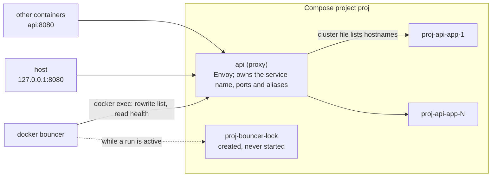
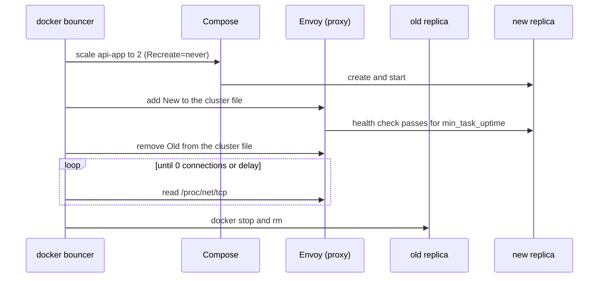

# docker-bouncer

A Docker CLI plugin that gives Compose services Kubernetes-style Services (a
stable address in front of healthy replicas, served by an Envoy proxy) and
rolling bounces (start the new version, gate it on health, drain the old one)
on a single host, without a control plane or a state store. Everything it
knows is derived on each run from the compose file, container labels and
Envoy's live view.

## Install

From a release. Assets are named `docker-bouncer-<os>-<arch>` for
`linux` and `darwin`, `amd64` and `arm64`; set `bin` to yours. On macOS use
`shasum -a 256 -c` instead of `sha256sum -c`.

```sh
v=vX.Y.Z; bin=docker-bouncer-linux-arm64
mkdir -p ~/.docker/cli-plugins && (
  cd ~/.docker/cli-plugins &&
  curl -fsSLO https://github.com/cuza/docker-bouncer/releases/download/$v/$bin &&
  curl -fsSLO https://github.com/cuza/docker-bouncer/releases/download/$v/SHA256SUMS &&
  sha256sum -c --ignore-missing SHA256SUMS &&
  mv $bin docker-bouncer && chmod +x docker-bouncer && rm SHA256SUMS
)
docker bouncer --help
```

From source: `go build -o ~/.docker/cli-plugins/docker-bouncer .`

## How it works



A crossover bounce of `api` with one replica:



There is no state store: every run reads the compose file, container labels
and Envoy's live view. Each revision of a Service lives in its replicas'
labels (gzip and base64, like Helm's release secrets), which is where
`history` and `undo` read it. After a host reboot Docker restarts the
containers and Envoy re-resolves the replica hostnames within a second, so no
Bouncer run is needed, provided the replicas have a `restart:` policy.

## Configuration

A service becomes a Bouncer Service by having an `x-bouncer` block. Replica
count is the standard `deploy.replicas`; ports are the service's existing
`ports:` (published) and `expose:` (internal). Your compose file is never
rewritten.

```yaml
services:
  api:
    image: registry/api@sha256:…
    deploy: { replicas: 2 }
    ports:
      - "127.0.0.1:8080:8080"          # Envoy publishes 127.0.0.1:8080 → replicas :8080
    healthcheck:
      test: ["CMD", "curl", "-fsS", "http://localhost:8080/health"]
    x-bouncer:
      bounce_method: crossover
      bounce_margin_factor: 0.95
      bounce_overprovision_factor: 1.0
      min_task_uptime: 10s
      bounce_health_timeout: 300s
      healthcheck: { mode: http, uri: /health }
      drain_method: envoy
      drain_method_params: { delay: 95s }
      history_max: 3

  worker:
    image: registry/worker@sha256:…
    expose: ["8001"]                    # internal Service: Envoy listens on worker:8001
    x-bouncer: {}                       # all defaults
```

| Key | Default | Meaning |
|---|---|---|
| `bounce_method` | `crossover` | `crossover`, `upthendown`, `downthenup`, `brutal` (see below) |
| `bounce_margin_factor` | `0.95` | `maxUnavailable = floor(N × (1 − factor))`; 0..1 |
| `bounce_overprovision_factor` | `1.0` | `maxSurge = ceil(N × factor)`; 0..1 |
| `min_task_uptime` | `10s` | a new replica must stay healthy this long before it counts |
| `bounce_health_timeout` | `300s` | from creation until happy, per new replica |
| `healthcheck.mode` / `.uri` | `http` / `/health` | Envoy's active health check (only `http`) |
| `drain_method` | `envoy` | `envoy`, `http` (URL hooks), `noop` |
| `drain_method_params.delay` | `60s` | upper bound on a drain |
| `drain_method_params.drain` / `.is_safe_to_kill` / `.stop_draining` | none | `http` hooks, each `{method, path, success_codes}` (`GET` and any 2xx by default); the first two are required for `http` |
| `history_max` | `3` | previous revisions kept in labels |
| `proxy_image` | `envoyproxy/envoy:v1.39.1` | must be the Ubuntu-based image (needs `bash`, `cat`) |

Durations use Go syntax (`95s`, `5m`). A Docker `healthcheck` is optional;
when present a replica must pass it too, and Envoy's check always gates.
Long-syntax ports may set `app_protocol`, but only `http` is accepted. A
Bouncer Service needs `ports:` or `expose:` and cannot set `container_name`,
`mac_address`, or a network's `ipv4_address`, `ipv6_address` or
`mac_address` (the proxy and every replica would share it). Unknown
`x-bouncer` keys are rejected. Configuration errors exit 2 before anything
changes.

Give Bouncer Services `restart: unless-stopped` (or `always`) so replicas come
back after a host reboot without a Bouncer run; the proxy already has it.

### What gets derived

For each Bouncer Service `S` the project is transformed in memory:

- `S` becomes the Envoy proxy. It takes `S`'s ports, networks and aliases,
  so clients reach it exactly as they reached `S` under plain Compose.
- `S-app` holds the replicas: `S`'s config minus `ports:`.

Envoy's config is inline in the proxy's `command`, so nothing is written on
the host. `docker bouncer config` prints the derived project.

### Labels

| Label | On | Content |
|---|---|---|
| `bouncer.managed` | proxy, replicas | `true` |
| `bouncer.role` | proxy, replicas, lock | `proxy`, `replica` or `lock` |
| `bouncer.service` | proxy, replicas | the Service name `S` |
| `bouncer.admin-port` | proxy | Envoy admin port inside the container (9901, or 19901 if 9901 is a service port) |
| `bouncer.revision` | replicas | per-Service revision number, increasing |
| `bouncer.spec` | replicas | base64(gzip(normalised `S-app` config)); keeps `env_file` paths, not their contents |
| `bouncer.spec-hash` | replicas | hash of that config; the change detector |
| `bouncer.history` | replicas | base64(gzip(JSON of the previous `history_max` revisions)) |
| `bouncer.up-id` | replicas | ID of the `up`/`undo` run that created the revision |
| `bouncer.time` | replicas | when the revision was created (RFC 3339) |
| `bouncer.lock-owner` | lock | `user@host pid N` of the run holding the lock |

## How a bounce works

`up` pulls every needed image (including the proxy image) first, converges
plain services through Compose, then runs one loop per changed Service, all in
parallel. A Service changes when its desired spec hash differs from the
running `bouncer.spec-hash`, so running `up` twice is a no-op. The loop
recomputes from live state on every pass: it scales `S-app` up by one
(leaving old replicas untouched) while under `N + surge`, adds each new
replica's hostname to Envoy's cluster list once it runs (Envoy sends it
nothing until its health check passes), and drains and removes old replicas
one at a time while `happy(new) + live(old) − 1 ≥ N − unavailable`. A new
replica is happy when Docker reports it healthy (if it has a healthcheck),
Envoy reports it healthy, and it has stayed so for `min_task_uptime`.

| `bounce_method` | Behaviour | Kubernetes equivalent |
|---|---|---|
| `crossover` | the loop with `surge = ceil(N × overprovision)`, `unavailable = floor(N × (1 − margin))`; if both are 0, surge becomes 1 so a bounce can always progress | RollingUpdate |
| `upthendown` | the loop with `surge = N`, `unavailable = 0` | none |
| `downthenup` | drain and stop all old, then create new; a gap in service | Recreate |
| `brutal` | create all N new replicas first (up to 2N), then stop old ones immediately: off the list, no health gates, no drain wait (dev only) | RollingUpdate, `maxUnavailable = 100%` |

### Drain methods

| `drain_method` | Behaviour |
|---|---|
| `envoy` | Remove the replica from Envoy's list (in-flight requests continue), wait until Envoy holds no connection to it or `delay` passes, then stop it with its `stop_grace_period`. Long-lived streams end at `delay` and reconnect to a new replica. |
| `http` | Remove it from the list, call `drain`, poll `is_safe_to_kill` until it succeeds or `delay` passes, then stop it. Requests go from the proxy to the replica's first port. `stop_draining` is sent to replicas that predate the run when they are re-added to the list (an earlier, killed run may have drained them); it can reach replicas that were never drained, so it must be idempotent. |
| `noop` | Remove it from the list and stop it immediately. |

## Failure behaviour

Exit codes: `0` converged, `1` bounce failed, `2` configuration, validation or
pull error (nothing changed).

- **New replica never happy:** at `bounce_health_timeout` it is removed and
  stopped and `up` exits 1. Old replicas are drained only as new ones become
  happy, so the old version keeps serving.
- **Partial bounce (N > 1):** the bounce pauses. Happy new and remaining old
  replicas keep serving together (keep migrations expand/contract). Undo is
  explicit: `docker bouncer undo`, or `up` with the previous file.
- **Interrupted run:** every run starts by rebuilding Envoy's list from the
  running, healthy replicas, so the next `up` resumes. Ctrl-C (or SIGTERM)
  cancels cleanly and releases the lock; a second Ctrl-C kills.
- **Two runs at once:** a lock container `<project>-bouncer-lock` (created,
  never started) makes the second run exit with "bounce in progress by …". A
  SIGKILLed run leaves the lock behind; it is taken over once stale (5
  minutes, or `bounce_health_timeout` × Services if larger), or immediately
  with `up --force-unlock`.
- **Envoy rejects a list update:** the bounce fails before draining anything.

## Commands

Global flags as Compose: `-f/--file`, `-p/--project-name`,
`--project-directory`, `--profile`, `--env-file`.

| Command | Behaviour |
|---|---|
| `up [SERVICE…] [--pull always\|missing\|never] [--force-unlock]` | Pull, converge plain services, bounce Services in parallel; with SERVICE names, only those and their dependencies. Always detached. |
| `pull [SERVICE…]` | Pull images and the proxy image; change nothing. |
| `undo [SERVICE] [--to-revision N]` | Bounce back to a stored revision (default: the previous one), creating a new revision. Without a Service: every Service changed by the last `up`. |
| `history SERVICE` | Revision, time, image, up-id. |
| `ps` | Containers of the derived project with role (`live`, `new`, `old`, `draining`, `proxy`) and revision. |
| `logs SERVICE [--follow] [--proxy] [-n/--tail N]` | All replicas, prefixed; `--proxy` for Envoy. There is no `-f`: that is the global `--file`. |
| `ls` | Projects on the host with Bouncer Services and their status, from labels; no file needed. |
| `config` | The derived project, including the generated Envoy config. |
| `stop [SERVICE…] [-t/--timeout SECONDS]` | `compose stop` of the derived project, dependents first; no drain (stop ingress first). |
| `down` | `compose down` of the derived project; deletes revision history. |

## Limits

- Single host. No scheduling, autoscaling or multi-host.
- HTTP only; TCP Services are not supported.
- A change to the proxy's own definition (Envoy image, ports) recreates it
  before the bounce starts, which interrupts the Service briefly; `up` warns
  first.
- Plain `docker compose up` on the same project is unsupported: it would
  recreate `S` as the app and fight the proxy for its ports. The next
  `docker bouncer up` recreates `S` as the proxy, briefly interrupting it;
  the replicas are untouched.
- `docker bouncer config` output is not loadable by plain `docker compose`
  (the proxy entrypoint holds variables Compose would interpolate).
- A change to `deploy.replicas` alone scales `S-app` without a bounce.
- History lives on the replicas: `down` deletes it.

## License

Apache-2.0
